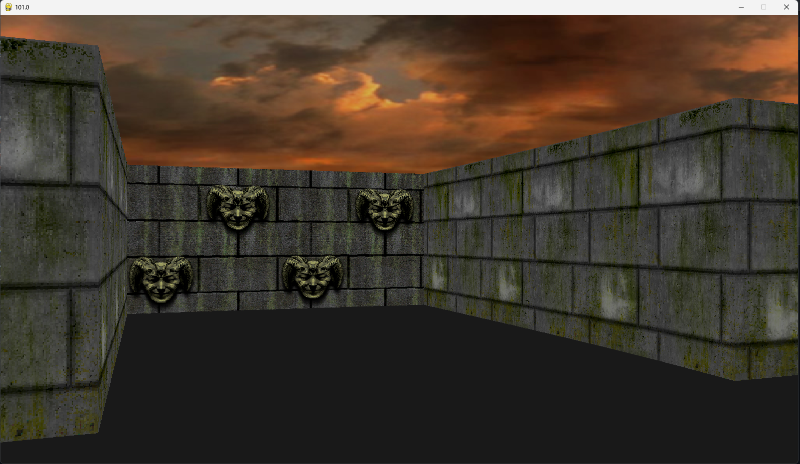
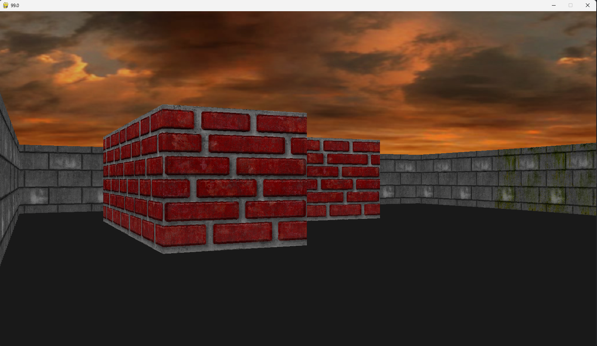

# Retro FPS Raycasting Engine
 


 
A Doom-style raycasting engine built from scratch in Python using Pygame. The engine renders a 3D perspective view of a 2D map in real time — the same core technique used in classic FPS games like Wolfenstein 3D and Doom. Built as an exercise in understanding the fundamentals of 3D rendering without a game engine.

---
 
## ✨ Current Features
 
- 🎮 **Raycasting Renderer** — Casts rays from the player's viewpoint across a 2D map to produce a real-time 3D perspective view
- 🧱 **Textured Walls** — Wall surfaces are rendered with textures, scaled by distance to produce a depth effect
- 🚶 **Player Movement** — First-person movement with rotation and forward/backward navigation
- 💥 **Collision Detection** — Player cannot walk through walls

---

## 📸 Preview





---

## 🔨 In Progress
 
- 👾 Sprites and enemies with AI
- 🔫 Weapons
- 🗺️ Minimap overlay
- 🔊 Sound effects and Music
- 💥 Collision detection improvements
- 🎮 Interactive gameplay
- 🔊 Sound effects and Music

---

## 🏗️ How Raycasting Works
 
The engine uses a technique called **raycasting** — for each vertical column of pixels on screen, a ray is projected from the player's position at a slightly different angle across the field of view. When the ray hits a wall, the distance is used to calculate how tall that wall slice should appear on screen — closer walls appear taller, distant walls appear shorter. Repeating this for every screen column produces the illusion of a 3D environment from a 2D map.
 
This is the exact technique id Software used in Wolfenstein 3D (1992), predating true 3D polygon rendering.
 
---

## 🗂️ Project Structure
 
```
FPS-Retro-Doom-Game/
├── main.py               # Game loop, initialisation, and main update/draw cycle
├── raycasting.py         # Core ray projection and wall rendering logic
├── object_renderer.py    # Draws wall slices, floor, ceiling, and textures to screen
├── player.py             # Player position, rotation, movement, and collision
├── map.py                # 2D grid map definition and wall layout
├── sprite_object.py      # Sprite rendering (in progress)
├── settings.py           # Constants — resolution, FOV, speed, colours
├── resources/            # Textures and assets
└── README.md
```

---

## 🚀 Getting Started
 
### Prerequisites
 
- Python 3.12
- pip
 
### Controls
 
| Key | Action |
|---|---|
| W / S | Move forward / backward |
| A / D | Rotate left / right |
| ESC | Quit |

---

## 🛠️ Tech Stack
 
| | |
|---|---|
| Language | Python 3 |
| Rendering | Custom raycasting engine (no game engine used) |
| Framework | Pygame |
| Technique | DDA (Digital Differential Analyser) ray-wall intersection |
